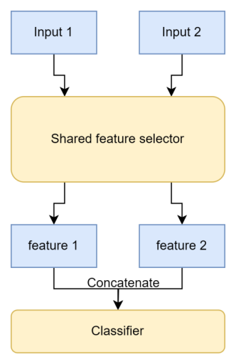
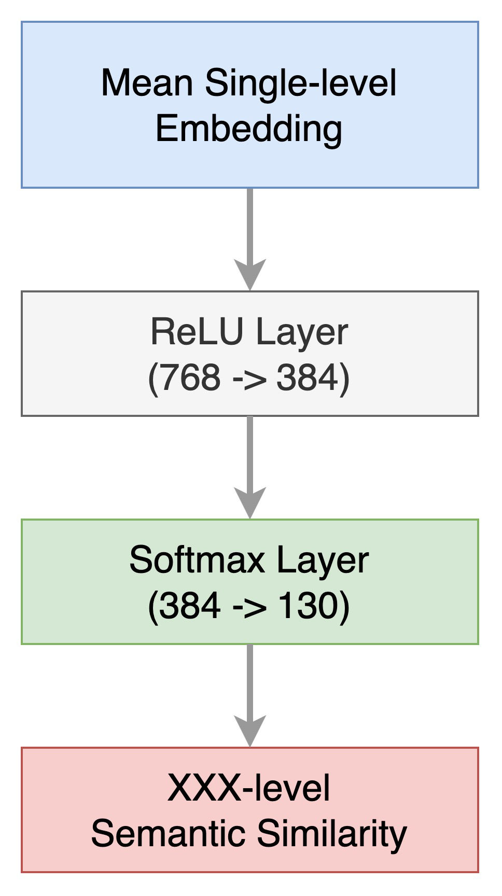
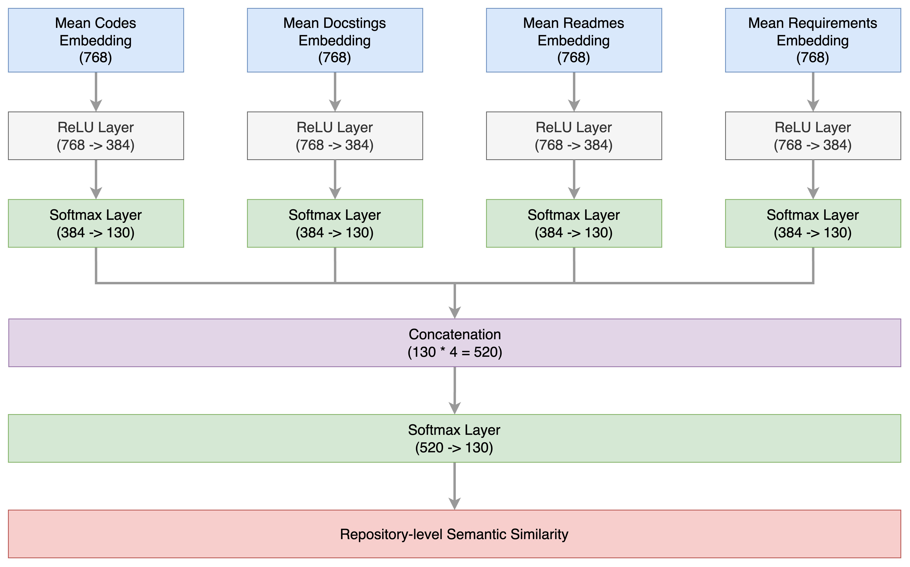
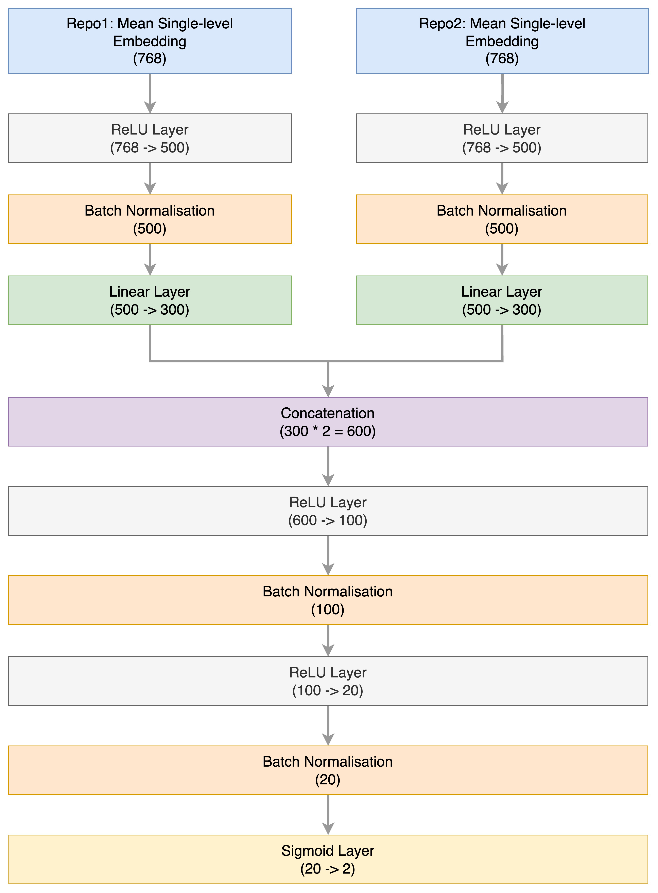
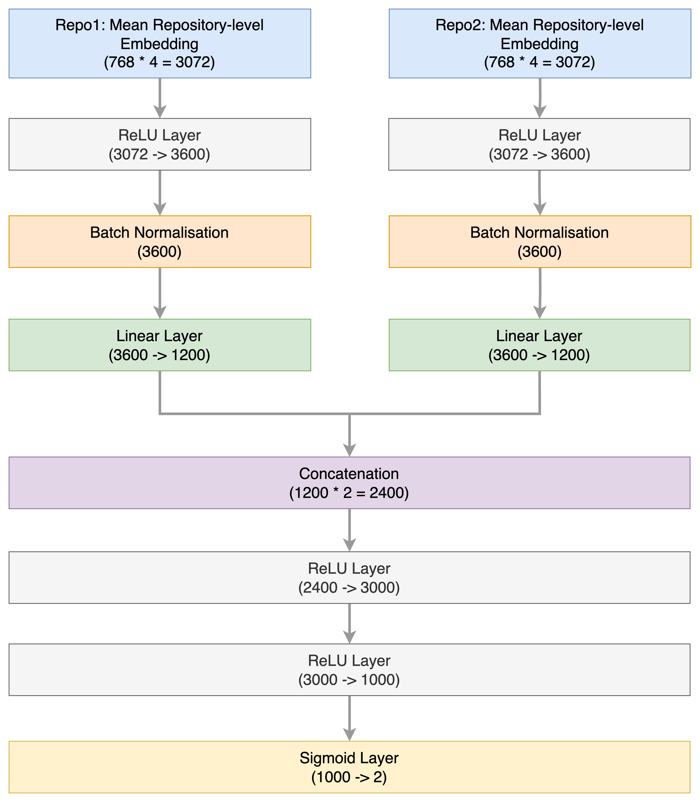
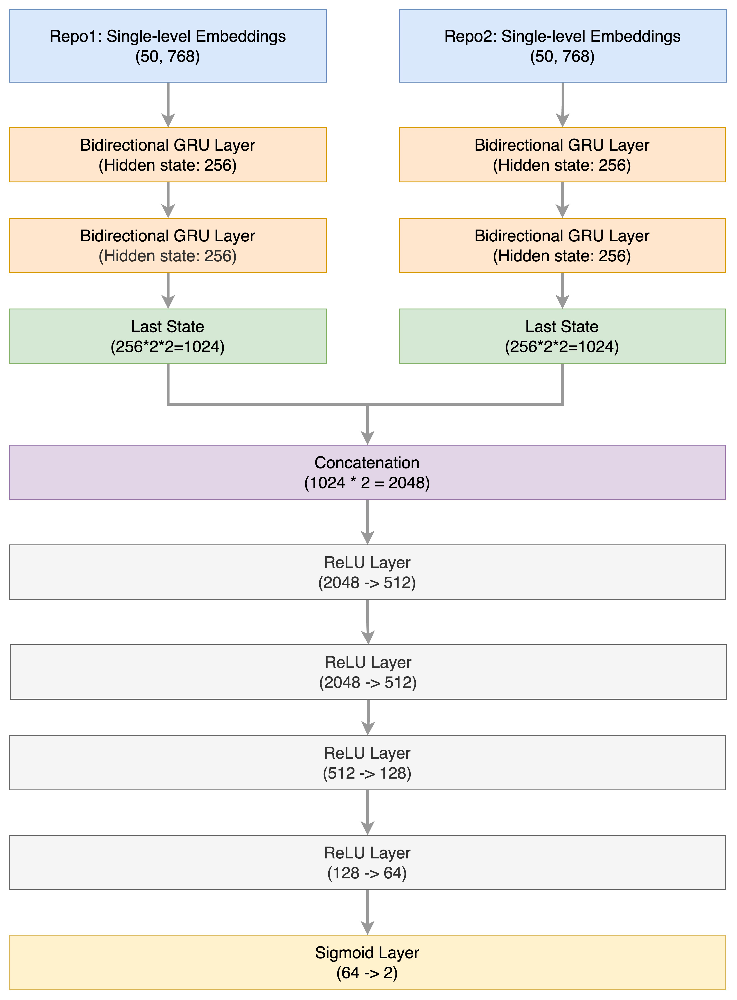
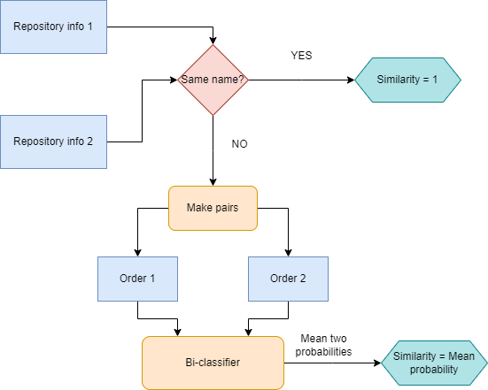
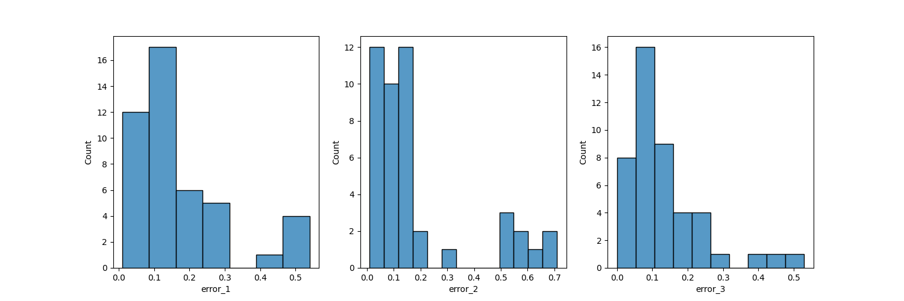
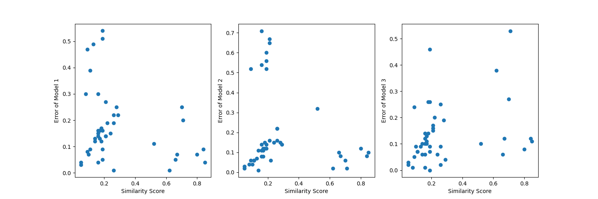

# SimilarityCal
## Description
SimilarityCal is a project for determining semantic similarity by using classification models among Python repositories based on the [RepoSim4Py](https://github.com/RepoMining/RepoSim4Py) project, which uses cosine similarity to calculate similarity directly.

This project is dedicated to finding an alternative to cosine similarity for similarity calculation. Based on the ```embeddings``` and ```mean embedding``` generated by RepoSim4Py, we propose three classification models to investigate how similarity is calculated.

Firstly, we propose two classification models using the ```mean embedding``` strategy: one is a multi-class classification model, and the other is a binary classification model. In the end, we discarded the multi-class classification model and kept the two better binary classification models (we call them No.1 and No.2).

Then we proposed a binary classification model based on the GRU sequence model using the ```embeddings``` strategy. Finally, we retained a better binary model based on the GRU sequence model (called No.3).

The No.1 and No.2 models are saved in the ```mean/TWINS_MODEL``` folder, while the No.3 model is in the ```sequential/TWINS_MODEL``` folder.

All saved models have similar designs, including a shared feature selector and a classifier, as shown below.
<div align=center>
  
</div>

## Quick tips
The shape of the ```embeddings``` is (n, 768), where n represents the length of the embeddings and 768 signifies the dimension of the semantic vector space.

The shape of the ```mean embedding``` is (1, 768). In other words, the mean embedding is the result of averaging over the length of the embeddings.

All the ```embeddings``` and ```mean embedding``` are generated by [RepoSim4Py](https://github.com/RepoMining/RepoSim4Py), referring to the RepoSim4Py [output](https://github.com/RepoMining/RepoSim4Py/tree/main/Script/output) folder and the [RepoSim4Py-pipeline](https://huggingface.co/Henry65/RepoSim4Py) HuggingFace pipeline.

For each ```embeddings``` and ```mean embedding```, we have five levels: ```codes-level```, ```docstrings-level```, ```readmes-level```, ```requirements-level```, and ```structure-level``` (discarded). Importantly, we also have a ```repository-level``` mean embedding, which is horizontally aggregated by other levels of mean embedding.

## Multi-class classification model -- mean embedding strategy

In the design of the multi-class classification model, our initial idea was to employ the mean embedding from each level (produced by RepoSim4Py) for the classification task of the repositories. Following this, we aimed to use the repository-level mean embedding (also generated by RepoSim4Py) for the same classification task. If the model exhibits high accuracy during this classification task, our intention would be to harness the output layer of the classification model (the softmax layer) as the semantic vector representation for each level (which can be conceptualised as embeddings for each level). By applying cosine similarity to these semantic vector representations, we can ascertain the semantic similarity between repositories at different levels. By the way, the output of the softmax layer consists of 130 probability values, as we have 130 unique topics.

After experimentation, we discarded the multi-class classification model because our model is overfitting. More specifically, our dataset has only 415 entries (training set and validation set), while there are 130 classification labels. This means that, on average, there are only about three samples per label.

In the following, we will just show diagrams of our model architecture and not show the evaluation results of the multi-class classification model, which can be found in the [mean_trainer.ipynb](https://github.com/RepoMining/SimilarityCal/blob/main/mean/mean_trainer.ipynb) notebook.

### Single-level mean embedding as input
Firstly, we build the network by taking the mean embedding on a single level as input, and its architecture is shown below.
<div align=center>
  
</div>

### Repository-level mean embedding as input
Then, we build the network by taking the repository-level mean embedding as input, and its architecture is shown below.
<div align=center>
  
</div>

## Binary classification model -- mean embedding strategy
As previously mentioned, due to the limited sample size, the multi-class classifier exhibited overfitting. This prompted us to increase the dataset volume and devise a binary classification model. The principle behind the binary classifier is simple: if two repositories belong to the same topic, the label assigned by the classifier is 1; otherwise, it’s 0. During the design phase of the binary model, we first employed the mean embedding from each level (provided, of course, by RepoSim4Py) to carry out the repository classification task. Subsequently, we utilised the repository-level mean embedding (also supplied by RepoSim4Py) for the same purpose. Should this model demonstrate extremely high accuracy in the classification task, we intend to employ the output from the sigmoid layer directly to determine the degree of similarity or dissimilarity between two repositories.

### Dataset building
We reconstructed the dataset by pairing repositories from the [awesome-python](https://github.com/vinta/awesome-python) dataset, which consists of 456 repositories. This involved creating pairings between the same repositories as well as pairings between different repositories in varying orders. We then relabeled the dataset. In total, this resulted in 207,936 entries. Upon analysing the data, it became evident that there were only 2,242 positive samples (with a label of 1). To counteract the imbalance that might skew our experimental results, we performed downsampling on the negative samples (with a label of 0) to match the number of positive samples, resulting in a total of 4,484 samples for the experiment. Ultimately, we partitioned the data using an 8:2 ratio, yielding a training set with 3,586 entries and a validation set with 898 entries.

### Single-level mean embedding as input
Similar to the multi-class classifier, we first defined a binary classifier that solely accepts a single embedding as its input. The architecture of this classifier can be seen below.
<div align=center>
  
</div>

The evaluation result is shown below.
<div style="align:center">
| Embedding type | Train accuracy | Valid accuracy |
|----------------|----------------| ------------ |
| codes-level          | 92.1%    | 71.05%         |
| docstrings-level     | 85.6%    | 67.04%         |
| readmes-level        | 89.7%    | 57.46%         |
| requirements-level   | 81.1%    | 58.8%          |
| structure-level      | 61.2%    | 53.56%          |
</div>

### Repository-level mean embedding as input
Then, we proposed a binary classifier that takes repository-level embedding as input. The architecture of this model is illustrated below.
<div align=center>
  
</div>

The evaluation result is shown below.
| Embedding type | Train accuracy | Valid accuracy |
|----------------|----------------| ------------ |
| repository-level          | 99.7%    | 94.21%  |

In addition to using the accuracy metric to evaluate classification models, we propose using the effectiveness metric to evaluate classification models. The effectiveness metric calculates the rate at which the same repository pairs can get over 95% probability. In the end, we saved two models based on repository-level embedding as input (No.1 and No.2), and they were evaluated as shown below.
| Models | Accuracy | Loss   | Recall           | Precision        | Effectiveness |
| -------- | ---------- | -------- | ------------------ | ------------------ | --------------- |
| No.1 | 91.5%    | 0.2128 | [0.9201, 0.9938] | [0.9932, 0.9203] | 71/200        |
| No.2 | 83.3%    | 0.3695 | [0.8314, 0.9880] | [0.9139, 0.9938] | 172/200       |

The training process and evaluation process is in the [mean/mean_trainer.ipynb](https://github.com/RepoMining/SimilarityCal/blob/main/mean/mean_trainer.ipynb) notebook.

## Binary classification model based on GRU/RNNs model -- embeddings strategy
The traditional classification models described above are built upon mean embeddings. To further delve into the semantic information present in repositories, it’s worth considering the sequential semantic information. Indeed, embeddings inherently encompass sequence information, and resorting to mean embeddings could lead to a loss of this temporal data. In this section, we will utilise embeddings from various levels generated by RepoSim4Py to study the semantic similarities between repositories. Similar to the traditional classification models, we will continue to undertake classification tasks. It’s imperative to note that the acceptable length for our embeddings is 50. Should it exceed this, it will be truncated; if shorter, it will be padded. By the way, the dataset is consistent with the binary classifier part.

### Single-level embeddings as input
The architecture of single-level embeddings as input is shown below.
<div align=center>
  
</div>
The evaluation result is shown below.

| Embedding type | Train accuracy |Valid accuracy |
|----------------|----------------| ------------ |
| codes-level          | 87.8%          | 81.7%          |
| docstrings-level       | 69.9%          | 52.34%         |
| readmes-level         | 64.8%          | 55.13%         | 
| requirements-level    | 61%            | 54.02%         | 

### Repository-level embeddings as input
The architecture of repository-level embeddings as input is shown below.
<div align=center>
  
</div>

The evaluation result is shown below.
| Embedding type | Train accuracy | Valid accuracy |
|----------------|----------------| ------------ |
| repository-level          | 99.8%    | 90.4%  |

Using the effectiveness metric to evaluate the binary classification model based on GRU/RNNs model (only saved 1 model named No.3).

| Models | Accuracy | Loss   | Recall           | Precision        | Effectiveness |
| ---------- | -------- |------------------| ------------------ | --------------- | --------------- |
| No.3 | 88.9%    | 0.2613 | [0.8880, 0.9888] | [0.9877, 0.9038] | 55/200        |

However, the performance of No.3 is close to No.1 and No.2 by using ```mean embedding```  strategy, but No.3 takes lots of training time. More details of the training process and evaluation process can be found in the [sequential/sequential_trainer.ipynb](https://github.com/RepoMining/SimilarityCal/blob/main/sequential/sequential_trainer.ipynb) file.

## Similarity calculation on binary classification model

The similarity here actually represents the probability determined by the binary classifier that two repositories share the same topic. However, due to the nature of the twins neural network model, to ensure consistent results regardless of the input order, the final similarity is the average of the outputs obtained by feeding two repository embedding in different orders. In addition, before proceeding, the names of the two repositories are compared, and if they are the same, the similarity is directly set to 1.

<div align=center>
  
</div>

## Usage and prediction
You need to change your current directory to the ```scripts``` folder before you can enjoy the above features.
```bash
cd scripts
```
and then use the following format to run this program.
```bash
python calculateSim.py -t sequential -i output.pkl -m "E:\SimilarityCal\sequential\TWINS_MODEL\Best_Param_2023-07-24 16-54-35.596111.pt" -o sequential
```
where
```
-t set the strategy -- mean/sequential
-i set the input -- the output file generated by RepoSim4Py
-m set the model -- the model path
-o set the output directory
```
The ```output.pkl``` is the same one in the RepoSim4Py project [output](https://github.com/RepoMining/RepoSim4Py/tree/main/Script/output) folder.

Finally, the execution results of models No.1 and No.2 (binary classification models) are shown in the ```scripts/mean_result```, while the execution result of model No.3 (binary classification model based on GRU/RNNs model) is shown in the ```scripts/sequential_result```.

## Comparison results analysis
The similarity calculation result (using models No.1, No.2, and No.3) compared to RepoSim4Py is shown in the [evaluation_comparison_result.csv](https://github.com/RepoMining/SimilarityCal/blob/main/scripts/evaluation_comparison_result.csv) file.

We use [ComparisonResultAnalysis.py](https://github.com/RepoMining/SimilarityCal/blob/main/scripts/ComparisonResultAnalysis.py) file to analyse the comparison result.
1. **Error Calculation Results**
  * **Mean error**: Model No.1 has the lowest mean error of 0.13; Model No.2 comes second with 0.17; Model No.3 has the highest of 0.20.
  * **Maximum error**: Model No.1 has a max error of 0.44; Model No.2 has 0.36; Model No.3 has a considerably high max error of 0.65.
  * **Error distribution**: From the error distribution plots, we can see Model No.1 and No.2’s errors follow near normal distributions; Model No.3’s error distribution is right-skewed, indicating some large error values.
<div align=center>
  
</div>

2. **Error Correlation Analysis**: There exist strong positive correlations amongst different models, with correlation coefficients ranging from 0.82 to 0.94. This suggests systemic biases or overfitting to similar data across models.
3. **Error over Similarity Score Analysis**: From the scatter plots, we can observe that as the similarity score increases, errors of all three models generally display a decreasing trend, but Model No.3 has some noticeable scattered points.
<div align=center>
  
</div>

Overall, Model No.1 demonstrates optimal performance across evaluation metrics. Model No.3 shows considerably higher maximum error and potential systemic biases that require further optimisation. This analysis aptly demonstrates the efficacy of the mean embedding approach we have employed, as well as the viability of using binary classification probabilities as a measure of similarity between repositories.
