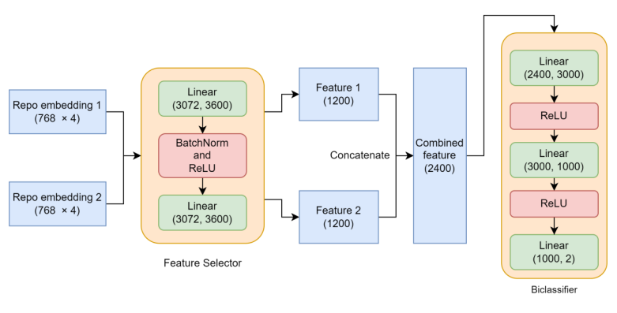
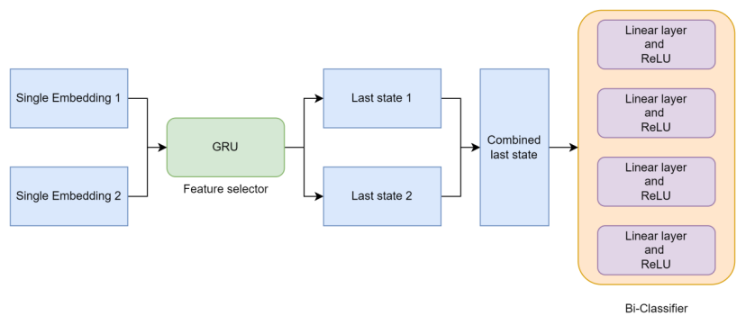
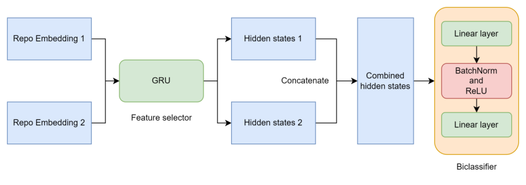

# SimilarityCal
## Description
SimilarityCal is a project for determining semantic similarity by using classification models among Python repositories based on the [RepoSim4Py](https://github.com/RepoMining/RepoSim4Py) project, which uses cosine similarity to calculate similarity directly.

This project is dedicated to finding an alternative to cosine similarity for similarity calculation. Based on the ```embeddings``` and ```mean embedding``` generated by RepoSim4Py, we propose three classification models to investigate how similarity is calculated.

Firstly, we propose two classification models using the mean embedding strategy, one is a multi-class classification model, and the other is a binary classification model. In the end, we discarded the multi-class classification model and kept the two better binary classification models (we call them No. 1 and No. 2).

Then we proposed a binary classification model based on the GRU sequence model using the ```embeddings``` strategy and finally retained a better binary model based on the GRU sequence model (called No. 3).

The No. 1 and No. 2 models are saved in the ```mean/TWINS_MODEL``` folder, while the No. 3 model is in the ```sequential/TWINS_MODEL``` folder.

All saved models have similar designs, including a shared feature selector and a classifier, as shown below.


## Quick knowledge
The shape of the ```embeddings``` is (n, 768), where n represents the length of the embeddings and 768 signifies the dimension of the semantic vector space.

The shape of the ```mean embedding``` is (1, 768). In other words, the mean embedding is the result of averaging over the length of the embeddings.

## Usage and prediction
You need to change your current directory to the ```scripts``` folder before you enjoy the above features.
```bash
cd scripts
```
and then use the following format to run this program.
```bash
python calculateSim.py -t sequential -i output.pkl -m "E:\SimilarityCal\sequential\TWINS_MODEL\Best_Param_2023-07-24 16-54-35.596111.pt" -o sequential
```
where
```
-t set the strategy
-i set the input
-m set the model
-o set the output directory
```
The ```output.pkl``` is the same one in https://github.com/RepoMining/RepoSim4Py/tree/main/Script/output.
Finally, the result after running the script is the file evaluation_comparison_result.csv.


## 1. Mean strategy

In ```mean``` directory, the code in notebook show all works for mean strategy.

We are aware that identical sub-embedding from different repositories may differ. In order to enable their computation within a neural network, it is necessary to standardize their lengths. If each type of embedding is one feature, there are five features. The “mean” strategy is that because each feature has different length, the embedding will be calculated mean value in the first dimension. As a result, all embedding will be compressed as a 1 × 768 matrix.


**Multi-classification:**

The idea of the multi-classification is to observe the accuracy of the model. If the accuracy is high and available, the output of the *softmax* layer which is a vector consisting of 130 probabilities can be used to calculate the cosine similarity.

In this part, each single embedding has been tested and the repo embbeding also is trained. The results are not good, it is overfitting due to limit of dataset.
The sub-strategy has been **discarded** and there is no implementation of API and it just is implemented for testing.


**Bi-classification:**

The models calculate the probability whether two repositories have same topic and the probability is as similarity.

(1) Each single embedding is trained and tested. It verifies that these single embeddings perform well in binary classification tasks.

(2) Repo embedding is used to train the model and there are two models and README file saved in ```TWINS_MODEL```.

The structure is:



The effectiveness metric calculates the rate how many same repository pairs can get over 95% probability.

The performance of two models:


| Models | Accuracy | Loss   | Recall           | Precision        | Effectiveness |
| -------- | ---------- | -------- | ------------------ | ------------------ | --------------- |
| A | 83.3%    | 0.3695 | [0.8314, 0.9880] | [0.9139, 0.9938] | 172/200       |
| B | 91.5%    | 0.2128 | [0.9201, 0.9938] | [0.9932, 0.9203] | 71/200        |


## Train
In ```mean``` directory, run the ```Repo embedding``` part in ```mean_trainer.ipynb``` file.


## Sequential strategy

In ```sequential``` directory, the code in notebook show all works for sequential strategy. embedding inherently possess sequential information, and utilizing the "mean" strategy may result in a substantial loss of information. In order to harness this information more effectively, a datasets containing sequential information is generated. This is achieved by cutting or padding the length of each embedding to 50, ensuring that the datasets can be utilized for training neural network models. Subsequent models in the following sections utilize this sequential datasets.

The models based on sequential stragety are bi-clssifiers.

A RNN model is designed which consists of GRU and a classifier.


**single embedding**: A Bi-classifier designed to accept unfixed-length embedding accepts the row single embedding and calculates the similarity. This is also to **test the validation** of each embedding performance in a sequential model. It is not used to train and predict.




**Repo embedding:** A Bi-classifier designed to accept fixed-length embedding accepts the repo embedding whose length is 50.




The performance of a single embedding classifier is not good, but training accuracies are available, so all of embedding can be kept in repo embedding to train the models.


| Embedding type | Train accuracy | Train loss | Valid accuracy | Valid loss |
|----------------|----------------| ------------ |----------------| ------------ |
| Codes          | 87.8%          | 0.003      | 81.7%          | 0.004      |
| Document       | 69.9%          | 0.005      | 52.34%         | 0.005      |
| Requirement    | 61%            | 0.005      | 54.02%         | 0.005      |
| README         | 64.8%          | 0.005      | 55.13%         | 0.005      |


However, the performance of the repo embedding classifier is close to the mean strategy and it takes a lot of time.


| Accuracy | Loss   | Recall           | Precision        | Effectiveness |
| ---------- | -------- |------------------| ------------------ | --------------- |
| 88.9%    | 0.2613 | [0.8880, 0.9888] | [0.9877, 0.9038] | 55/200        |


## Train
In ```sequential``` directory, run the ```Repo embedding``` part of ```sequentail_trainer.ipynb``` file.


## Calculate Similarity

The similarity here actually represents the probability determined by the binary classifier that two repositories share the same topic. However, due to the nature of the twins neural network model, to ensure consistent results regardless of the input order, the final similarity is the average of the outputs obtained by feeding two repository embedding in different orders. In addition, before proceeding, the names of the two repositories are compared, and if they are the same, the similarity is directly set to 1.


